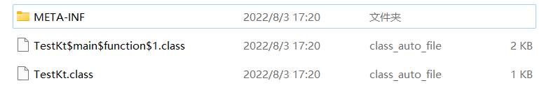
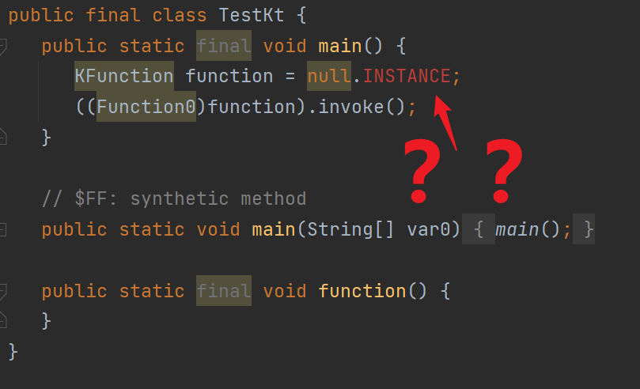
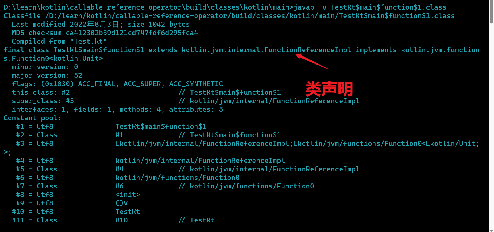
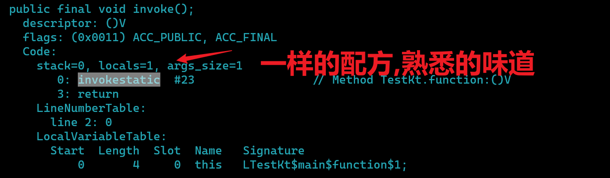
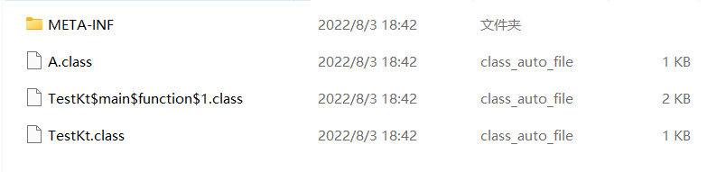
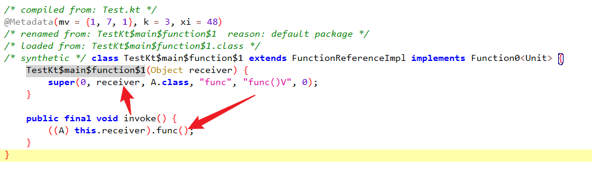

# ::操作符

::操作符可以干嘛?或者说是用来干什么的?

> **它是用于指向一个已经定义的函数或者属性的**.

## 引用函数

::可引用的函数分为两类

- top-level即顶层函数
- 成员函数

### 顶层函数

```kotlin
fun main() {
    val function = ::function
    function.invoke()
}

fun function() {

}
```

#### 产物

这一看不知道的还以为是lambda(你说他是lambda也没啥问题)


#### 实现原理

首先还得是反编译啊


还是看字节码吧

```
public final static main()V
   L0
    #获取静态变量TestKt$main$function$1.INSTANCE
    GETSTATIC TestKt$main$function$1.INSTANCE : LTestKt$main$function$1;
    ASTORE 0
   L1
    ALOAD 0
    #强转为kotlin的lambda类型接口
    CHECKCAST kotlin/jvm/functions/Function0
    INVOKEINTERFACE kotlin/jvm/functions/Function0.invoke ()Ljava/lang/Object; (itf)
    POP
   L2
    RETURN
   L3
    LOCALVARIABLE function Lkotlin/reflect/KFunction; L1 L3 0
```

匿名类



所以代码总结下来就等价于

```kotlin
fun main() {
    val function = {
        function()
    }
    function.invoke()
}

fun function() {

}
```

好像和lambda的实现是类似的

### 成员函数

```kotlin
fun main() {
    val a = A()
    val function = a::func
}

class A {
    fun func() {

    }
}
```

#### 产物

可以发现和前面的实现类似多生成了一个匿名类.



不过也有一定的差异多了一个receiver,而且也没有采用单例了.
不过实现也是类似的，相似度特别高


#### 实现原理

```
  public final static main()V
   L0
    LINENUMBER 13 L0
    NEW A               #实例化A对象
    DUP                 #复制栈顶元素
    INVOKESPECIAL A.<init> ()V      #调用构造
    ASTORE 0
   L1
    LINENUMBER 14 L1
    NEW TestKt$main$function$1      #new匿名类
    DUP                         
    ALOAD 0
    INVOKESPECIAL TestKt$main$function$1.<init> (LA;)V      #调用构造
    ASTORE 1
   L2
    LINENUMBER 15 L2
    ALOAD 1
    CHECKCAST kotlin/jvm/functions/Function0                #强转
    #调用接口
    INVOKEINTERFACE kotlin/jvm/functions/Function0.invoke ()Ljava/lang/Object; (itf)
    POP
   L3
    LINENUMBER 16 L3
    RETURN
```

所以等价的代码如下

```kotlin
fun main() {
    val a = A()
    val function = (Function0<Unit>) TestKt $main$function$1(a)
    function.invoke()
}
```

## 小结

- 对于函数 ::符号的方式就是生成匿名类
  > 值得注意的是—— ::操作符可以指向顶层函数和成员函数.
  > 不过对于顶层函数,这个function是个饿汉式单例,而对于成员函数没有使用单例,使用的时候就即时new.
- 生成的匿名类会实现Function接口(也就是高阶函数的接口)
  > 除此之外还会继承一个抽象类,而这个抽象类是kotlin的反射扩展,这边不做解释
- 而invoke方法会调用我们指定需要指向的函数

# 引用属性

明晰引用函数的实现以后会发现他们的实现是类似的,都是通过生成匿名类的方式实现,每一个::引用都会生成一个匿名类

```kotlin
fun main() {
    val property: KProperty0<String> = ::p
    println(property)
}

private val p = ""
```

```java
public static final void main(){
        KProperty0 property=ReferencePropertyKt$main$property$1.INSTANCE;
        System.out.println(property);
        }

final class ReferencePropertyKt$main$property$1 extends PropertyReference0Impl {
    public static final KProperty0 INSTANCE = new ReferencePropertyKt$main$property$1();

    ReferencePropertyKt$main$property$1() {
        super(ReferencePropertyKt.class, "p", "getP()Ljava/lang/String;", 1);
    }

    @Nullable
    public Object get() {
        return ReferencePropertyKt.access$getP$p();
    }
}
```

他呢只是将property的get函数包装了一层而已别无其他.
至于这个PropertyReference0Impl也是属于Kotlin reflection的内容在此不做赘述.

## 总结

- Kotlin的::操作符用于引用property和高阶函数
- 原理是通过生成匿名类,匿名类调用相应property的get或者调用指定的function
- Kotlin ::操作符和Kotlin的反射密切相连(Kotlin反射并不是自己实现的一套新的反射机制,只是对反射的增强)
