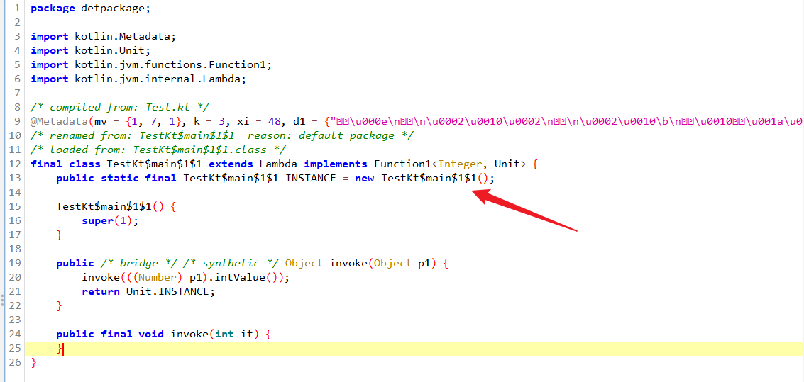

# 高阶函数

什么是高阶函数,所谓高阶函数。
在数学和计算机科学中，高阶函数是**至少**满足下列一个条件的函数:

- 接受一个或多个函数作为输入
- 输出一个函数

kotlin语言需要在jvm上运行(但不是只能),而java是不支持高阶函数的,java没有高阶函数,只有方法.

kotlin在jvm上运行又是怎么实现的呢?

看下字节码不就会了

```kotlin
fun function(block: (Int) -> Unit) {
    block(1)
}

fun main() {
    function {  }
}

```

```
# 高阶函数最后被编译成了一个类也即是Fuction类
# FunctionN表示输入参数的个数Function1表示输入参数为1个的函数类型.
public final static function(Lkotlin/jvm/functions/Function1;)V
    # checkNotNull
   L0
    ALOAD 0
    LDC "block"
    INVOKESTATIC kotlin/jvm/internal/Intrinsics.checkNotNullParameter (Ljava/lang/Object;Ljava/lang/String;)V
   L1
    LINENUMBER 8 L1
    ALOAD 0
    ICONST_1
    # block.invoke()
    INVOKESTATIC java/lang/Integer.valueOf (I)Ljava/lang/Integer;
    INVOKEINTERFACE kotlin/jvm/functions/Function1.invoke (Ljava/lang/Object;)Ljava/lang/Object; (itf)
    POP
   L2
    LINENUMBER 9 L2
    RETURN
}


public final static main()V
   L0
    LINENUMBER 14 L0
    GETSTATIC TestKt$main$1.INSTANCE : LTestKt$main$1;          
    #获取内部类的静态属性
    CHECKCAST kotlin/jvm/functions/Function1    #强转
    INVOKESTATIC TestKt.function (Lkotlin/jvm/functions/Function1;)V
    # 调用function函数
   L1
    LINENUMBER 29 L1
    RETURN

   # 嘿还有一个内部类
  final static INNERCLASS TestKt$main$1 null null
}

```

代码等价于
```java
public static void main() {
    function((Function1<Int,Unit>)TestKt$main$1.INSTANCE)
}
```

上面的逻辑中使用到了一个名为TestKt$main$1的内部类




所以高阶函数的实现还是比较简单的
类似于java的匿名类的实现,通过编译器生成一个内部类并实现相应的接口(名称的生成规则都是类似的)
但是不同的是————**java的匿名类在每一次调用都会直接new,但是kotlin的高阶函数是一个饿汉式的单例**


留给读者一个简单的小问题
下方代码会new多少个Function1实例?
```kotlin
fun main() {

    repeat(10) {
        function {}
    }

    repeat(10) {
        function { }
    }

    repeat(10) {
        function { }
    }

}
```

答案是3个你答对了吗?