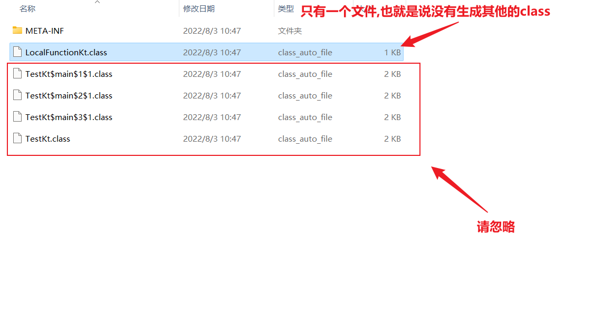
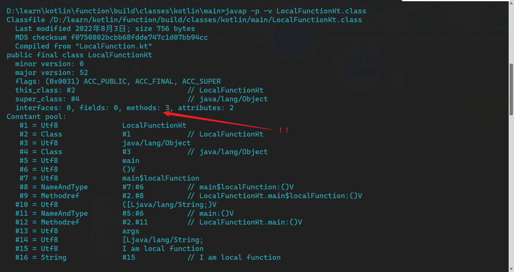
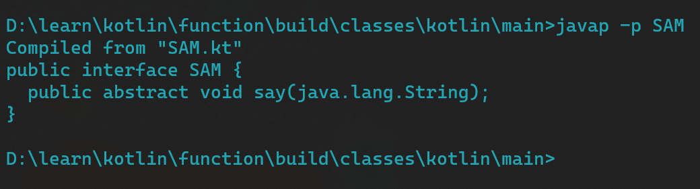
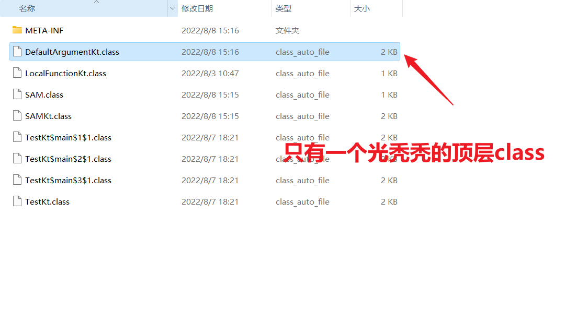
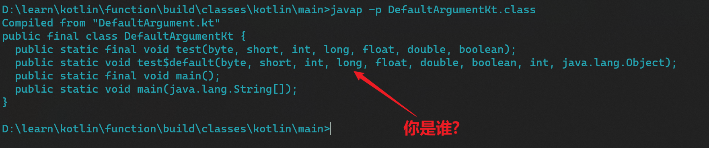

# 高阶函数

什么是高阶函数,所谓高阶函数。
在数学和计算机科学中，高阶函数是**至少**满足下列一个条件的函数:

- 接受一个或多个函数作为输入
- 输出一个函数

kotlin语言需要在jvm上运行(但不是只能),而java是不支持高阶函数的,java没有高阶函数,只有方法.

kotlin在jvm上运行又是怎么实现的呢?

看下字节码不就会了

```kotlin
fun function(block: (Int) -> Unit) {
    block(1)
}

fun main() {
    function { }
}

```

```
# 高阶函数最后被编译成了一个类也即是Fuction类
# FunctionN表示输入参数的个数Function1表示输入参数为1个的函数类型.
public final static function(Lkotlin/jvm/functions/Function1;)V
    # checkNotNull
   L0
    ALOAD 0
    LDC "block"
    INVOKESTATIC kotlin/jvm/internal/Intrinsics.checkNotNullParameter (Ljava/lang/Object;Ljava/lang/String;)V
   L1
    LINENUMBER 8 L1
    ALOAD 0
    ICONST_1
    # block.invoke()
    INVOKESTATIC java/lang/Integer.valueOf (I)Ljava/lang/Integer;
    INVOKEINTERFACE kotlin/jvm/functions/Function1.invoke (Ljava/lang/Object;)Ljava/lang/Object; (itf)
    POP
   L2
    LINENUMBER 9 L2
    RETURN
}


public final static main()V
   L0
    LINENUMBER 14 L0
    GETSTATIC TestKt$main$1.INSTANCE : LTestKt$main$1;          
    #获取内部类的静态属性
    CHECKCAST kotlin/jvm/functions/Function1    #强转
    INVOKESTATIC TestKt.function (Lkotlin/jvm/functions/Function1;)V
    # 调用function函数
   L1
    LINENUMBER 29 L1
    RETURN

   # 嘿还有一个内部类
  final static INNERCLASS TestKt$main$1 null null
}

```

代码等价于

```java
public static void main(){
        function((Function1<Int, Unit>)TestKt$main$1.INSTANCE)
        }
```

上面的逻辑中使用到了一个名为TestKt$main$1的内部类


所以高阶函数的实现还是比较简单的
类似于java的匿名类的实现,通过编译器生成一个内部类并实现相应的接口(名称的生成规则都是类似的)
但是不同的是————**java的匿名类在每一次调用都会直接new,但是kotlin的高阶函数是一个饿汉式的单例**

留给读者一个简单的小问题
下方代码会new多少个Function1实例?

```kotlin
fun main() {

    repeat(10) {
        function {}
    }

    repeat(10) {
        function { }
    }

    repeat(10) {
        function { }
    }

}
```

答案是3个你答对了吗?

# 局部函数

**所谓局部函数就是在函数内部定义函数**

## 关于java

java显然在语法上是不支持的.
这样的代码显然是会报错的.

```java
public class Test {
    public static void main(String[] args) {

        public void doSome () {
            System.out.println("This is a local method");
        }

        doSome();

    }
}
```

## 关于Kotlin

kotlin显然是支持这样的写法的.

```kotlin
fun main() {
    fun localFunction() {
        println("I am local function")
    }

    localFunction()

}

```

## 实现原理

秉承着知其然知其所以然,很有必要知道这样一个方便的语法特性是如何是如何实现的.
打开show kotlin bytecode插件decompile ohh~
好像看不懂

```java
public final class LocalFunctionKt {
    public static final void main() {
      <undefinedtype > $fun$localFunction$1 = null.INSTANCE;
        $fun$localFunction$1.invoke();
    }

    // $FF: synthetic method
    public static void main(String[] var0) {
        main();
    }
}
```

考虑看看有咩有额外的的class生成,
经分析后发现显然没有


接着分析字节码



```
{
  public static final void main();
    descriptor: ()V
    flags: (0x0019) ACC_PUBLIC, ACC_STATIC, ACC_FINAL
    Code:
      stack=0, locals=0, args_size=0
         0: invokestatic  #9                  // Method main$localFunction:()V
         3: return

  public static void main(java.lang.String[]);
    descriptor: ([Ljava/lang/String;)V
    flags: (0x1009) ACC_PUBLIC, ACC_STATIC, ACC_SYNTHETIC
    Code:
      stack=0, locals=1, args_size=1
         0: invokestatic  #12                 // Method main:()V
         3: return
      LocalVariableTable:
        Start  Length  Slot  Name   Signature
            0       4     0  args   [Ljava/lang/String;

  private static final void main$localFunction();
    descriptor: ()V
    flags: (0x001a) ACC_PRIVATE, ACC_STATIC, ACC_FINAL
    Code:
      stack=2, locals=0, args_size=0
         0: ldc           #16                 // String I am local function
         2: getstatic     #22                 // Field java/lang/System.out:Ljava/io/PrintStream;
         5: swap
         6: invokevirtual #28                 // Method java/io/PrintStream.println:(Ljava/lang/Object;)V
         9: return
      LineNumberTable:
        line 3: 0
        line 4: 9
}
```

代码等价于

```java
public final class LocalFunctionKt {
    public static final void main() {
        main$localFunction();
    }

    public static void main(String[] args) {
        main();
    }

    private static final void main$localFunction() {
        System.out.println("I am local function");
    }
}
```

- 所以kotlin的局部函数其实也就是普通的函数
- 编译以后是同级的
- 其实现原理也就是通过编译器静态检查从而实现所谓的局部

# SAM接口

SAM即(Single Abstract Method)即单抽象方法接口,属于接口的一种定义方式
是一种比较方便的语法糖。

```kotlin
fun interface SAM {
    fun say(a: String): Unit
}

fun main() {

    samTest {
        println(it)
    }

}

fun samTest(sam: SAM) {
    sam.say("Hello")
}
```

接口是好接口



分析一下调用处

```
public final static main()V
   L0
    # 原来是你啊,java lambda表达式
    INVOKEDYNAMIC say()LSAM; [
      // handle kind 0x6 : INVOKESTATIC
      java/lang/invoke/LambdaMetafactory.metafactory(Ljava/lang/invoke/MethodHandles$Lookup;Ljava/lang/String;Ljava/lang/invoke/MethodType;Ljava/lang/invoke/MethodType;Ljava/lang/invoke/MethodHandle;Ljava/lang/invoke/MethodType;)Ljava/lang/invoke/CallSite;
      // arguments:
      (Ljava/lang/String;)V, 
      // handle kind 0x6 : INVOKESTATIC
      SAMKt.main$lambda-0(Ljava/lang/String;)V, 
      (Ljava/lang/String;)V
    ]
   L1
    LINENUMBER 13 L1
    INVOKESTATIC SAMKt.samTest (LSAM;)V
   L2
    LINENUMBER 17 L2
    RETURN
   L3
    MAXSTACK = 1
    MAXLOCALS = 0
```

也就是说kotlin sam接口底层是通过使用java lambda表达式,关于java
lambda表达式的具体实现,可以参考自[个人博客](https://juejin.cn/post/7126485060697456647)

# 函数默认参数

函数默认参数是一个不错的特性(对于kotlin来说是,对java那就不好说了)

```kotlin
fun test(
    a: Byte = 0,
    b: Short,
    c: Int = 1,
    d: Long,
    e: Float = 2f,
    f: Double,
    g: Boolean = false,
) {
}

fun main() {
    test(a = Byte.MAX_VALUE, b = 10, c = Int.MAX_VALUE, d = 11, e = Float.MAX_VALUE, f = 12.0, g = true)
    test(b = 10, c = Int.MAX_VALUE, d = 11, e = Float.MAX_VALUE, f = 12.0, g = true)
    test(b = 10, c = Int.MAX_VALUE, d = 11, e = Float.MAX_VALUE, f = 12.0)
    test(b = 10, d = 11, f = 12.0)
}
```

## 编译产物



## javap



很明显在原来的基础上生成了一个default method

## 源代码分析

```java

public class DefaultArgument {

    public static final void test(byte a, short b, int c, long d, float e, double f, boolean g) {
    }

    // $FF: synthetic method
    public static void test$default(byte var0, short var1, int var2, long var3, float var5, double var6, boolean var8, int var9, Object var10) {
        if ((var9 & 1) != 0) {
            var0 = 0;
        }

        if ((var9 & 4) != 0) {
            var2 = 1;
        }

        if ((var9 & 16) != 0) {
            var5 = 2.0F;
        }

        if ((var9 & 64) != 0) {
            var8 = false;
        }

        test(var0, var1, var2, var3, var5, var6, var8);
    }

    public static final void main() {
        test((byte) 127, (short) 10, Integer.MAX_VALUE, 11L, Float.MAX_VALUE, 12.0, true);
        test$default((byte) 0, (short) 10, Integer.MAX_VALUE, 11L, Float.MAX_VALUE, 12.0, true, 1, (Object) null);
        test$default((byte) 0, (short) 10, Integer.MAX_VALUE, 11L, Float.MAX_VALUE, 12.0, false, 65, (Object) null);
        test$default((byte) 0, (short) 10, 0, 11L, 0.0F, 12.0, false, 85, (Object) null);
    }

}

```

- 我们定义函数没有做特殊处理
- 生成了一个额外的default
- 对于默认参数通过xx$default方法进行中转
- 没有使用默认参数的调用直接调用函数本身

所以默认参数的具体实现其实就是$default方法

```java
public class DefaultArgumentKt {

    public static final void test(byte a, short b, int c, long d, float e, double f, boolean g) {
    }

    // $FF: synthetic method
    //参数在原来的基础上多了两个: 一个int,一个Object
    //这个Object不知道是干嘛的,不过也不重要,因为内部也没有用到它,猜测应该是用于做标记的(给编译器看告诉编译器这是个default method)
    //int作为过来人告诉你这是用来标记默认参数的个数的(他这里是用的二进制做标记)
    public static void test$default(byte var0, short var1, int var2, long var3, float var5, double var6, boolean var8, int var9, Object var10) {

        //盲猜这里的一片调用是用来给默认参数赋值的
        //因为后面就是直接调用的方法,只有可能是在这里进行的默认参数的处理

        if ((var9 & 1) != 0) {
            var0 = 0;
        }

        if ((var9 & 4) != 0) {
            var2 = 1;
        }

        if ((var9 & 16) != 0) {
            var5 = 2.0F;
        }

        if ((var9 & 64) != 0) {
            var8 = false;
        }

        test(var0, var1, var2, var3, var5, var6, var8);
    }

    public static final void main() {
        test((byte) 127, (short) 10, Integer.MAX_VALUE, 11L, Float.MAX_VALUE, 12.0, true);
        test$default((byte) 0, (short) 10, Integer.MAX_VALUE, 11L, Float.MAX_VALUE, 12.0, true, 1, (Object) null);
        test$default((byte) 0, (short) 10, Integer.MAX_VALUE, 11L, Float.MAX_VALUE, 12.0, false, 65, (Object) null);
        test$default((byte) 0, (short) 10, 0, 11L, 0.0F, 12.0, false, 85, (Object) null);
    }

}
```

梳理了大概我们再看看我们默认参数的定义

```kotlin
//我们这里的默认参数参数的位次分别是
//1,3,5,7
//数值分别是0,1,2f,false
fun test(
    a: Byte = 0,
    b: Short,
    c: Int = 1,
    d: Long,
    e: Float = 2f,
    f: Double,
    g: Boolean = false,
) {
}
```

转过头看看调用处

```java
public class DefaultArgumentKt {
    public static void test$default(
            byte var0,
            short var1,
            int var2,
            long var3,
            float var5,
            double var6,
            boolean var8,
            int var9,
            Object var10
    ) {
        //第1位默认值0
        //1 == 2 ^ (1 - 1)
        if ((var9 & 1) != 0) {
            var0 = 0;
        }
        //第3位默认值1
        //4 == 2 ^ (3 - 1)
        if ((var9 & 4) != 0) {
            var2 = 1;
        }
        //第5位默认值值2f
        //16 == 2 ^ (5 - 1)
        if ((var9 & 16) != 0) {
            var5 = 2.0F;
        }
        //第7位默认值false
        //64 == 2 ^ (7 - 1)
        if ((var9 & 64) != 0) {
            var8 = false;
        }

    }
}


```

分析一下传递参数的位置的值的情况

```
//没有使用默认参数
test((byte)127, (short)10, Integer.MAX_VALUE, 11L, Float.MAX_VALUE, 12.0, true);
//1 默认参数
test$default((byte)0, (short)10, Integer.MAX_VALUE, 11L, Float.MAX_VALUE, 12.0, true, 1, (Object)null);
//1 7位默认参数 
test$default((byte)0, (short)10, Integer.MAX_VALUE, 11L, Float.MAX_VALUE, 12.0, false, 65, (Object)null);
//1 3 5 7位默认参数
test$default((byte)0, (short)10, 0, 11L, 0.0F, 12.0, false, 85, (Object)null);
```

1 = 2<sup>(1 - 1)</sup>

64 = 2<sup>(1 - 1)</sup>+2 <sup>(7 - 1)</sup>

85 = 2<sup>(1 - 1)</sup> + 2<sup>(3 - 1)</sup> + 2<sup>(5 - 1)</sup> + 2<sup>(7 - 1)</sup>

- 可以发现默认参数这里使用了一个二进制的int来存放我们每一位是否选择使用默认参数,如果对应二进制位的值为1表明使用默认值,0表明不使用
- 使用默认值很简单就将参数赋值为对应的默认值
- 不使用就不对参数值进行覆盖