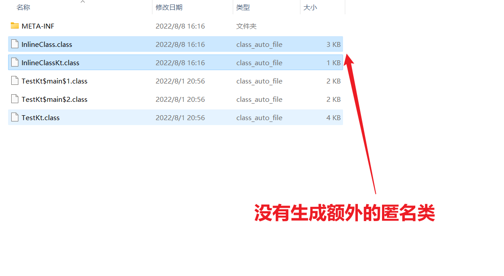
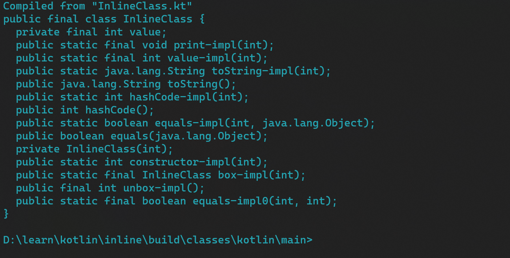

# inline

我们都知道内联表示的是`代码内联`这个内联指的就是将代码直接抄过来

即将在调用处把代码copy过去

怎么看？

```kotlin
inline fun call(block: () -> Unit) {
    println("==I am Call ==")
    block()
}

fun testInline() {
    call {
        println("Hello World")
    }
}
```

```
public final static testInline()V
   L0
    LINENUMBER 16 L0
   L1
    ICONST_0
    ISTORE 0
   L2
    LINENUMBER 34 L2
    LDC "==I am Call ==" !!!!!!!!!!!!!!
    ASTORE 1
   L3
    GETSTATIC java/lang/System.out : Ljava/io/PrintStream;
    ALOAD 1
    INVOKEVIRTUAL java/io/PrintStream.println (Ljava/lang/Object;)V
   L4
   L5
    LINENUMBER 35 L5
   L6
    ICONST_0
    ISTORE 2
   L7
    LINENUMBER 17 L7
    LDC "Hello World"
    ASTORE 3
   L8
    GETSTATIC java/lang/System.out : Ljava/io/PrintStream;
    ALOAD 3
    INVOKEVIRTUAL java/io/PrintStream.println (Ljava/lang/Object;)V
   L9
   L10
    LINENUMBER 18 L10
    NOP
   L11
   L12
    LINENUMBER 35 L12
    NOP
   L13
    LINENUMBER 36 L13
    NOP
   L14
    LINENUMBER 19 L14
    RETURN
```

关于crossline和noinline加强内联,一个减弱内联.可自行分析.

最后还需要说明内联只针对于kotlin,对于javac可是不认inline的
(因为内联的实现也就是通过kotlinc进行代码内联)


# 开胃菜

suspendCoroutineUninterceptedOrReturn在协程中频繁用到.
笔者在学习协程的时候见过n多次这个函数调用,奈何当时能力不够,难于对其有什么理解.

为什么suspendCoroutineUninterceptedOrReturn分析没有头绪呢?
因为函数是空的!!

```kotlin
public suspend inline fun <T> suspendCoroutineUninterceptedOrReturn(crossinline block: (Continuation<T>) -> Any?): T {
    contract { callsInPlace(block, InvocationKind.EXACTLY_ONCE) }
    throw NotImplementedError("Implementation of suspendCoroutineUninterceptedOrReturn is intrinsic")
}
```

Implementation of suspendCoroutineUninterceptedOrReturn is intrinsic
函数实现是内部特性.

空的✌怎么办,好像看不了,对吧?对吗?

对了一半,你看inline!  inline内联函数,内联?分析调用处?妙啊!

```kotlin
suspend fun a(): String {
    return suspendCoroutineUninterceptedOrReturn<String> {
        "-----------------------------------------"
        COROUTINE_SUSPENDED
    }
}
```

这里可以考虑decompile java或者还是class file总体都不难

```
public final static a(Lkotlin/coroutines/Continuation;)Ljava/lang/Object;

   L0
    LINENUMBER 28 L0
    ALOAD 0         #Continuation局部变量入栈
    ASTORE 1        #存入局部变量表为1的位置
   L1
    ICONST_0        #1入栈
    ISTORE 2        #存入index为2的局部变量表
   L2
    LINENUMBER 29 L2
    NOP             #空指令,忽略
   L3
    LINENUMBER 30 L3
    INVOKESTATIC kotlin/coroutines/intrinsics/IntrinsicsKt.getCOROUTINE_SUSPENDED ()Ljava/lang/Object;
    #获取挂起标记
   L4
   L5
    LINENUMBER 28 L5
    DUP             #复制栈顶
    INVOKESTATIC kotlin/coroutines/intrinsics/IntrinsicsKt.getCOROUTINE_SUSPENDED ()Ljava/lang/Object;
    #获取挂起标记
    IF_ACMPNE L6    #对比栈顶元素即getCOROUTINE_SUSPENDED != 对比栈顶元素即getCOROUTINE_SUSPENDED
    #满足就直接跳转道L6即return处
    #否则需要执行invokestatic指令
    ALOAD 0         
    INVOKESTATIC kotlin/coroutines/jvm/internal/DebugProbesKt.probeCoroutineSuspended (Lkotlin/coroutines/Continuation;)V
   L7
   L6
    LINENUMBER 28 L6
    ARETURN
```

这段代码等价于

```kotlin


fun a(arg: Continuation<String>): Any {
    //suspendCoroutineUninterceptedOrReturn内传入的高阶函数的返回值
    val result: Any
    if (result == COROUTINE_SUSPENDED) {
        probeCoroutineSuspended()
    }
    return result
}
```

可能这个实例不清晰如果是这样,就好看了。

```kotlin
suspend fun a(): String {
    return suspendCoroutineUninterceptedOrReturn<String> {
        "-----------------------------------------"
    }
}
```

简单的来说就是suspendCoroutineUninterceptedOrReturn会一些指令进行内联
除了内联代码以外还生成一个一点点代码
他会把这个高阶函数的返回值与COROUTINE_SUSPENDED进行比对。一致就表明被挂起了,就会调用probeSuspended
(这个调用是用来调试协程的,他的具体实现在debugger里面,点开看源码也是空的)

为什么需要用到suspendCoroutineUninterceptedOrReturn
因为java代码和kotlin无法形容,最最主要的是无法获取Continuation,因为就高阶函数内传入Continuation,无论怎么写在语法层面上都是不合理的,
所以就只能通过internal进行处理(这里的internal**应该是**kotlinc)对字节码做特殊操作.

# inline class / value class

kotlin value class应该算是比较新的语法特性.

官网的介绍是非常简单的：

- 它可以实现接口,但是不可以有父类,它**必须也只能**有一个成员
- 它会将class参数进行内联,所有调用value class实例到最后都会被抹除成成员

## test

```kotlin
@JvmInline
value class InlineClass(
    private val value: Int
) {
    fun print() {
        println(value)
    }

    fun value(): Int {
        return value
    }
}

fun main() {
    val x = InlineClass(1)
    println(x.value())
    x.print()
}
```

## 产物分析



## 源码分析

```
public final class InlineClassKt {
  public static final void main();
    Code:
       0: iconst_1              #val x = InlineClass(1),这里传入了成员1，需要压入操作数栈进行value class的初始化
       # value class甚至没有调用new指令
       1: invokestatic  #12                 // Method InlineClass."constructor-impl":(I)I  #返回值亮了int。
       4: istore_0
       5: iload_0
       #调用x.value()
       6: invokestatic  #15                 // Method InlineClass."value-impl":(I)I
       9: istore_1
      10: getstatic     #21                 // Field java/lang/System.out:Ljava/io/PrintStream;
      13: iload_1
      14: invokevirtual #27                 // Method java/io/PrintStream.println:(I)V
      17: iload_0
      #调用x.print()
      18: invokestatic  #30                 // Method InlineClass."print-impl":(I)V
      21: return

  public static void main(java.lang.String[]);
    Code:
       0: invokestatic  #35                 // Method main:()V
       3: return
}
```

代码等价于

```kotlin
fun main() {
    //很好奇吧?
    //为什么会有-,这在java语法不是不合法的嘛?
    //java是java,字节码的执行是在jvm上,java != jvm
    //-虽然不符合java language specification,但是符合jvm规范
    //这也暗示了kotlin的value class目前不支持java的直接互调.(反射呢?不知道没试过).
    val x: Int = InlineClass.`constructor-impl`(1)
    println(InlineClass.`value-impl`(x))
    InlineClass.`print-impl`(x)
}
```



看了以后其实就发现了,这和我们的基本类型很类似,自带自动拆装箱。

```java
public final class InlineClass {
    private final int value;

    // $FF: synthetic method
    private InlineClass(int value) {
        this.value = value;
    }

    public static final void print_impl/* $FF was: print-impl*/(int $this) {
        System.out.println($this);
    }

    public static final int value_impl/* $FF was: value-impl*/(int $this) {
        return $this;
    }

    public static int constructor_impl/* $FF was: constructor-impl*/(int value) {
        return value;
    }

    // $FF: synthetic method
    public static final InlineClass box_impl/* $FF was: box-impl*/(int v) {
        return new InlineClass(v);
    }

    public static String toString_impl/* $FF was: toString-impl*/(int var0) {
        return "InlineClass(value=" + var0 + ")";
    }

    public static int hashCode_impl/* $FF was: hashCode-impl*/(int var0) {
        return Integer.hashCode(var0);
    }

    public static boolean equals_impl/* $FF was: equals-impl*/(int var0, Object var1) {
        if (var1 instanceof InlineClass) {
            int var2 = ((InlineClass) var1).unbox - impl();
            if (var0 == var2) {
                return true;
            }
        }

        return false;
    }

    public static final boolean equals_impl0/* $FF was: equals-impl0*/(int p1, int p2) {
        return p1 == p2;
    }

    // $FF: synthetic method
    public final int unbox_impl/* $FF was: unbox-impl*/() {
        return this.value;
    }

    public String toString() {
        return toString - impl(this.value);
    }

    public int hashCode() {
        return hashCode - impl(this.value);
    }

    public boolean equals(Object var1) {
        return equals - impl(this.value, var1);
    }
}
```

## 小结

- value class/inline class类似于我们integer，在适合的时候会自动拆装箱，避免一些类对象的重复创建
- 目前value class还不是很成熟,不过也不是试验期的特性了,在kotlin的stdlib 无符号数的实现都是采用的value class(
  UByte,UShort,UInt,......)


